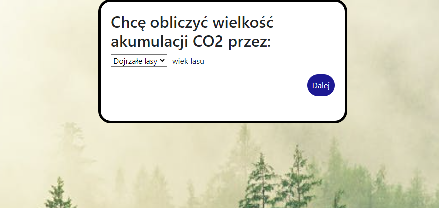

# CO2 Absorption Calculator
University Group Project under mentoring of Kainos company and Las na Zawsze foundation representatives.

The goal of this project is to pass the semester, and create a proof of concept algorithm, that calculates how much CO2 will forest absorb. As a 2 person project, work is splitted into backend and frontend.

User has to choose between mature forests and young forests, then he will be led to select according parameters for calculating CO2 absorption.

# Contributors

@darnoker, @WoollyAndWooden. Students at the University of Gdańsk.

# Backend

Project located in the /backend directory, developed using SpringBoot framework:

Used technologies:  
- Java 17 
- Spring Boot 2.7.5 
- Maven 3.8.6 
- Apache HttpClient
- Junit 5  

You can use `mvn package / mvnw package`, then Maven will compile and run tests  
Command `mvn spring-boot:run / mvnw spring-boot:run` will run the application. 

# Frontend

Project located in the /frontend directory, developed using React and react-bootstrap framework, tested for accessibility with pa11y tool.

Used technologies:  
- React.js 18.2.0 
- Pa11y 6.2.3
- React-bootstrap 2.7.0
- React-dom 18.2.0
- React-router-dom 5.1.2
- Axios 1.2.2
- Bootstrap 5.2.3

# Running App

StartApp.bat is responsible for running the application. If called without parameters, it will start both backend and frontend and its tests.

First parameter:

- backend
- frontend
- full (both backend and frontend)

Second parameter

- run
- test
- install

# Main page
The main page of this app looks like this:

